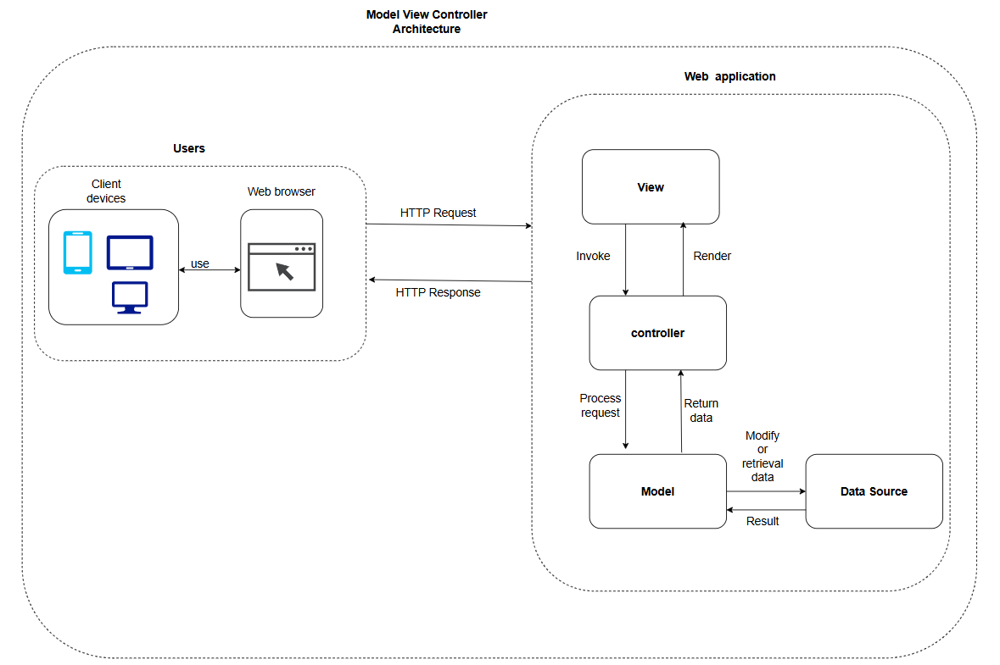
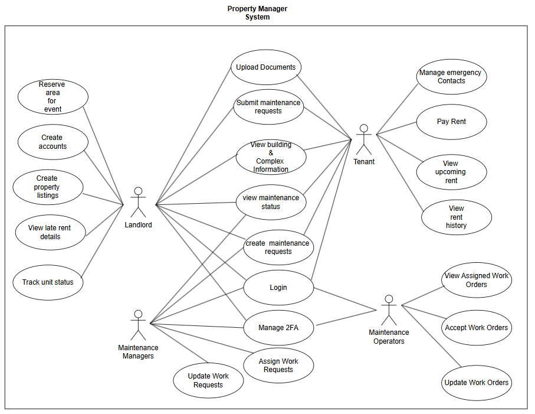

# PROJECT Design Documentation

> _The following template provides the headings for your Design
> Documentation.  As you edit each section make sure you remove these
> commentary 'blockquotes'; the lines that start with a > character
> and appear in the generated PDF in italics._

## Team Information
* Team name: TEAMNAME
* Team members
  * Kemoy Campbell
  * Jose Palomino
  * MEMBER3
  * MEMBER4

## Executive Summary

### Problem Statement
Property managers who own or oversee multiple rental properties often struggle with keeping track of unit availability, tenant information, lease agreements, and maintenance requests. Managing these tasks manually or through disjointed systems leads to inefficiencies, miscommunication, and delays in resolving tenant issues. Tenants also lack a centralized platform to access key apartment details, submit maintenance requests, and track their resolution status.

### Proposed Solution
A streamline platform that provides an all-in-one solution for property managers to efficiently oversee their rental properties. Platform capabilities includes:
- **Real-Time Unit Tracking**: Monitor the status of each property (occupied, available, or under maintenance).
- **Centralized Document Management**: Store and retrieve leases, payment proofs, maintenance records, and other important files.
- **Tenant Portal**: Enable tenants to access apartment rules, emergency contacts, and submit maintenance requests with descriptions and images.
- **Maintenance Request Tracking**: Maintain a transparent timeline for reported issues, status updates, and resolutions.
- **Secure Role-Based Access**: Ensure property managers and tenants have appropriate access through a secure login system.
- **Building-Wide Management**: Provide information on shared spaces, security features, and community updates.

## Requirements

This section describes the features of the application.

### Definition of MVP
> _Provide a simple description of the Minimum Viable Product._

### MVP Features
>  _Provide a list of top-level Epics and/or Stories of the MVP._

## Architecture and Design
This section describes the application architecture.

### Software Architecture

> _Describe your software architecture._
The diagram display an high level view of the platform
This project is setup using the Model View Controller (MVC) architecture pattern.

### Use Cases

> _Describe your use case diagram._

